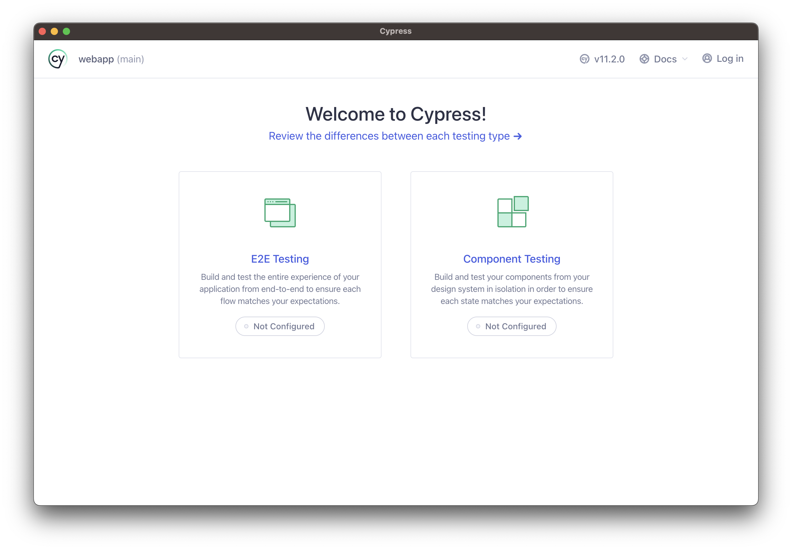
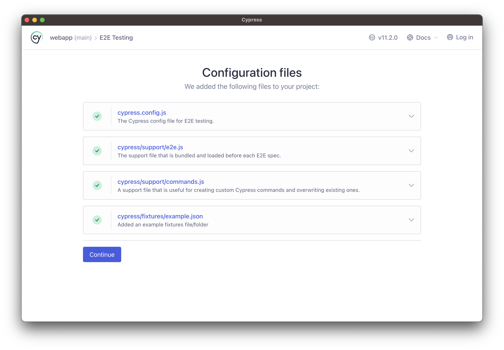
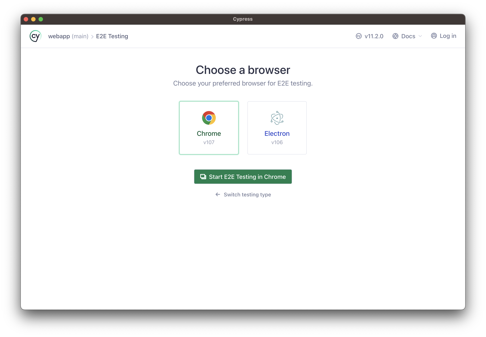
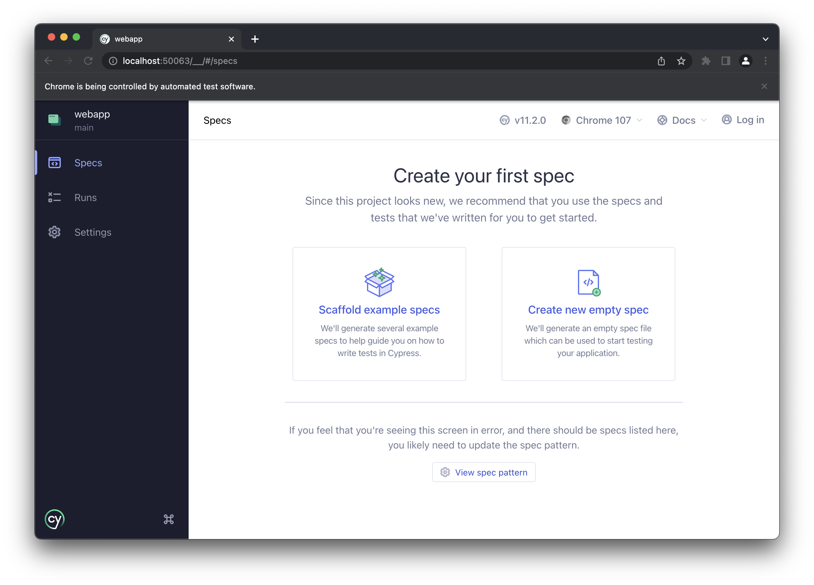
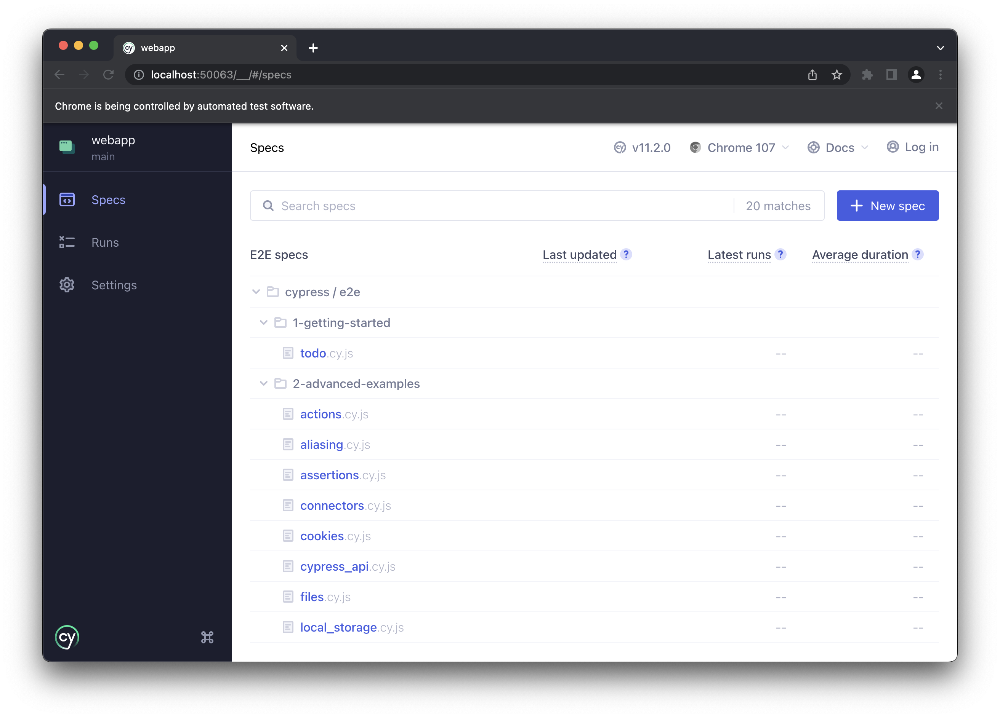
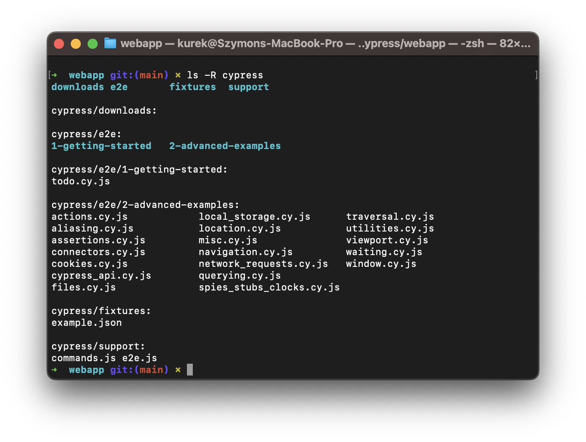
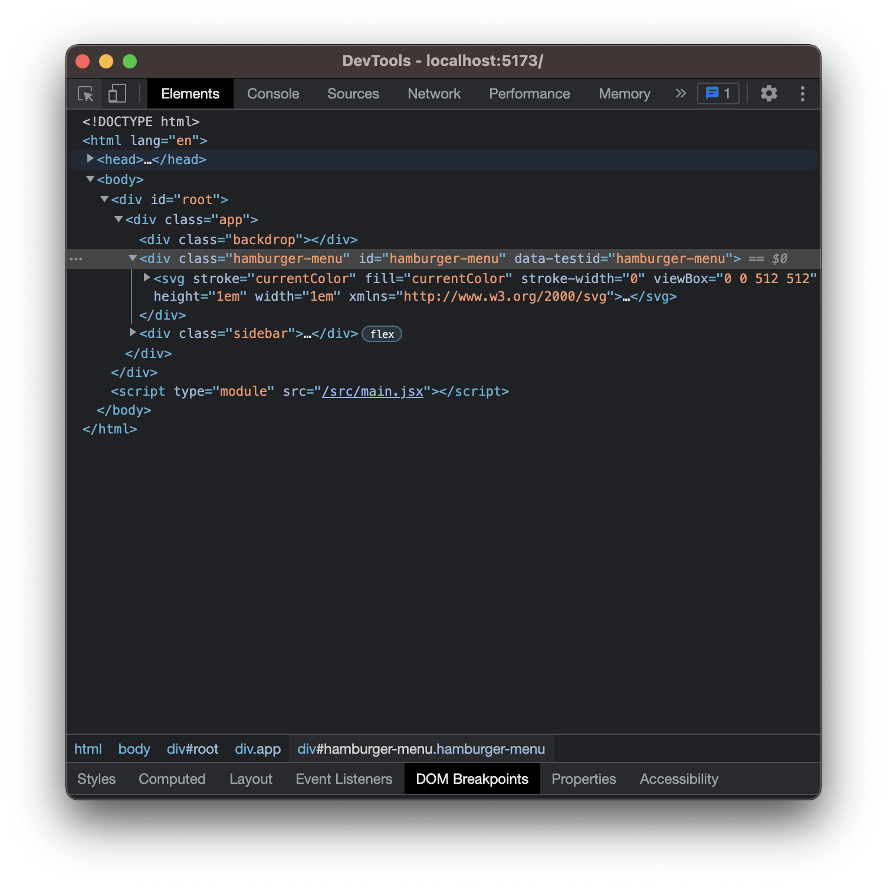
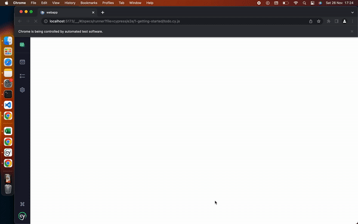

# Introduction 

In order to start writing e2e tests with Cypress you have to have basic knowledge on some concepts directly connected with it. 
Let's start from the beginning.

There are multiple sources from which you can learn cypress, but most common one (besides looking up answers in google and stack overflow) that you will be using is [Cypress.io documentation](https://docs.cypress.io/guides/overview/why-cypress#In-a-nutshell). I recommend reading at least "In a nutshell paragraph" before going any further. 

## Alternatives 

There are many alternatives for testing frameworks. Most popular for javascript are probably [Selenium](https://www.selenium.dev/) and [Playwright](https://playwright.dev/). So why should you use cypress instead of them? 

Well, first of all, it's easier and it doesn't require knowing some advanced concepts like asynchronous programming from the beginning. 

Second of all, it has bigger community, so most likely somebody encountered an issue that you are dealing with right now (easier debugging, quicker solutions). 

There are many more reasons, but you are probably not looking for alternatives if you are stuck here. You want to learn cypress, so let's get it. 

## How to setup environment 

After performing steps from [prerequisites](../README.md#prerequisites) you are all set up! 
Now all you have to do is (if you haven't already) open terminal and type `npx cypress open` which should result in opening this window. 

Click on E2E Testing. 

Make sure everything is checked and click `Continue`

You should see cypress homepage like this: 

Click on `Start E2E Testing in Chrome`

Click on `Scaffold example specs` and in opened popup window click `Okay, got it`. 

You should see that cypress generated example testing files for you, so you can check them out how to write some cypress code. In order to run them in the browser just click spec title and watch how cypress click through UI on it's own. You should also see that cypress generated 4 folders named `downloads`, `e2e`, `fixtures` and `support` and one config file named `cypress.config.js`. We'll cover all of them throughout this lecture. 

## Basic Syntax 

### `cy.get`

[docs](https://docs.cypress.io/api/commands/get)

`cy.get` is the most basic command that you will be using all the time. It allows you to interact with specific element in the UI, by targetting it's HTML selector. (If you don't know what it is, it will be discussed later [here](#html-tags-css-selectors)) 

In order to check element's selector open developer tools in the browser of choice, click on the icon of the cursor on the screen (inspect) and click on the element that you want to find. Afterwards you should see this element highlighted in the DOM tree. 

Now you can start to interact with it by grabbing it like: 
`cy.get('#hamburger-menu')` and.. 

### `cy.click`

[docs](https://docs.cypress.io/api/commands/click)

Basic form of interaction with elements is clicking on them. You can do that by chaining commands from get. In example, if we take selector from previous screenshot it should look something like this. 

`cy.get('#hamburger-menu').click()` which would emulate user interaction with this html element. 

<!-- TODO provide better demo, not so flashy -->

### `cy.type`

[docs](https://docs.cypress.io/api/commands/type)

Another way of interacting with elements in the UI. Instead of clicking them it emulates user input in `input` or `textarea` elements. 

### `cy.contains`

[docs](https://docs.cypress.io/api/commands/contains)

Different way of selecting UI elements. It allows you to target your HTML elements by text that they are containing. You can also limit results by giving certain selector. 

In example. You have very long text within the app that you are testing, and there are many strings (wrapped in `
` tags like "okay", but you don't care about text, only about `<button>` that have this selector. 

To do that you can use contains like `cy.contains('button', 'okay')`. In most cases you can just pass search text. `cy.contains('okay')`. 

Which one should you be using? Well, it depends - I prefer to use `cy.get` more often, as text on the UI can change more frequently than selectors underneath. Sometimes you don't have a choice, or you want to increase readability of your code so you would use `cy.contains`. 

### Parent, Child commands

Cypress differentiate commands on parent and child commands. Easiest way to tell the difference is by looking on command chain. If it's chained directly from `cy` object - it's parent command. If command required to be chained from different command - it's child command. Example of child commands are `type` or `find`

## HTML tags, CSS Selectors

Every item in the user interface have it's own representation in DOM Tree ([read more](https://javascript.info/dom-nodes)) as HTML tag. 

There is big number of existing tags ([read more](https://www.w3schools.com/TAGS/default.asp)), and in some cases you can have tags that you didn't know existed. Most common tags i.e. `
`, `<button>`, `<h1>(h2,h3,h4,h5,h6)`, `
`, `<input>`, ``. 

Every html tag have attributes defined by developers, i.e. `class`, `id`, `data-test-id`. etc. 
To "grab" them you have to use something known as CSS Selectors ([read more](https://www.w3schools.com/css/css_selectors.asp)).

- For `class` selector (most commonly used) you will use `.` (a dot), i.e. `.class`.
- For `id` selector you will use `#` (hash), i.e. `#id`
- For other attributes you will use different syntax, which will look like - `html tag[attribute="attribute-value"]` 

I know it looks scary if you didn't know that already, but it will all be clear and natural if you get some traction with it. Don't worry : )

## Selector Specificity 

So if there are so many ways to target elements (see [above](#html-tags-css-selectors)) then how should you use it in tests? 

Well, it is recommended to go with selector specificity which is used to determine which selector is more important than the other one. 

Basically you should go like this (go down the list if element doesn't have this)
1. id 
2. class
3. attribute
4. tag

[read more](https://developer.mozilla.org/en-US/docs/Web/CSS/Specificity)

## Code Playground. 

Time for you to see cypress in action!

## Extracting Logic to Commands.js 

