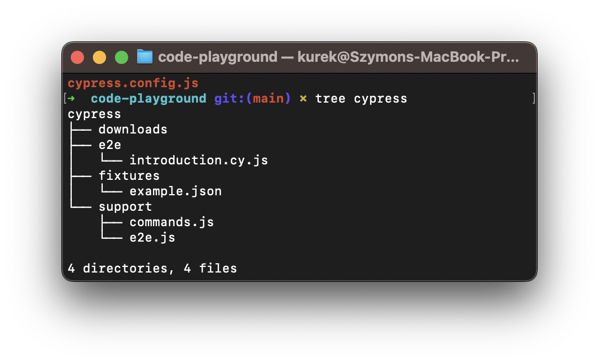
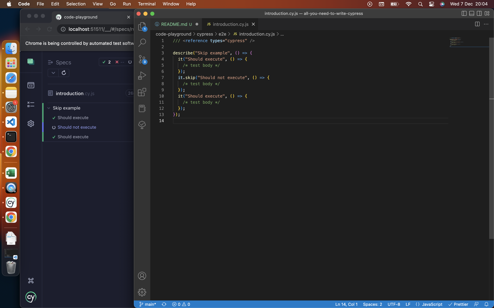
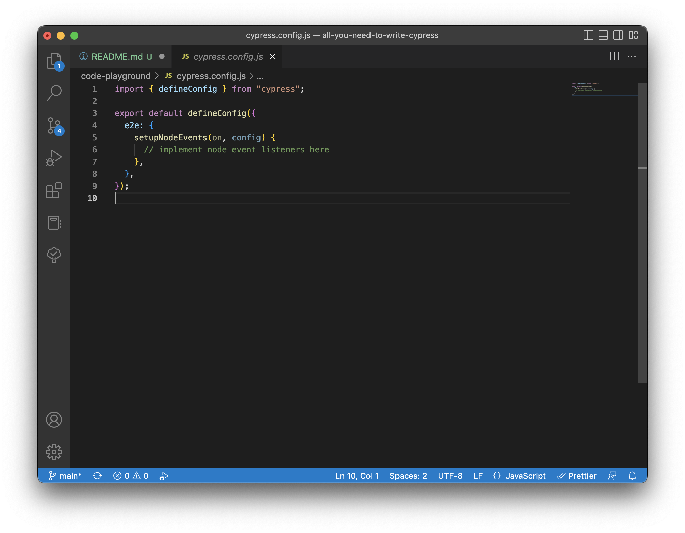
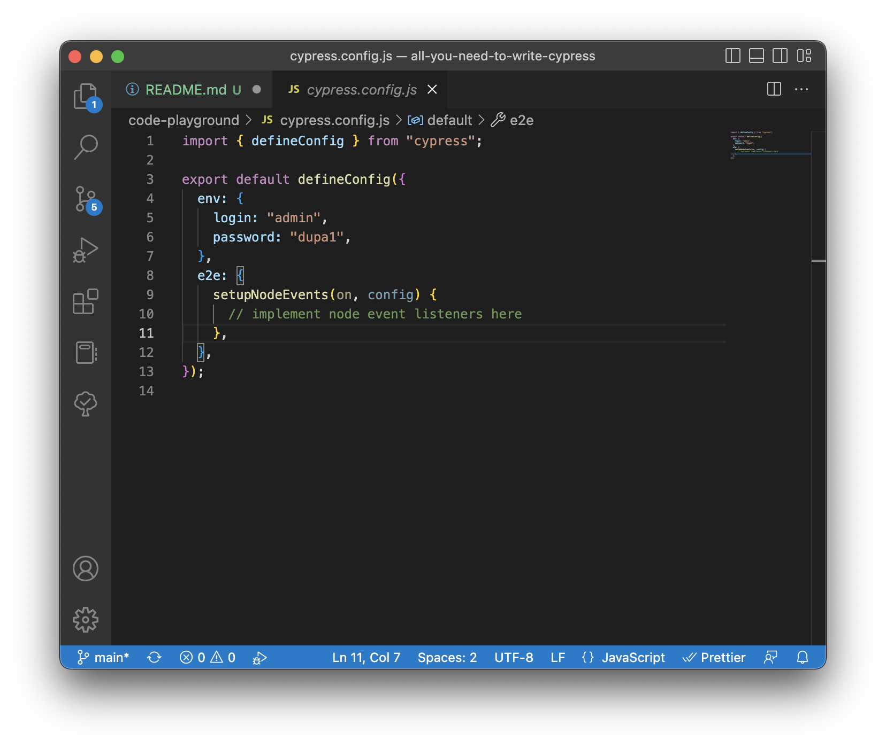
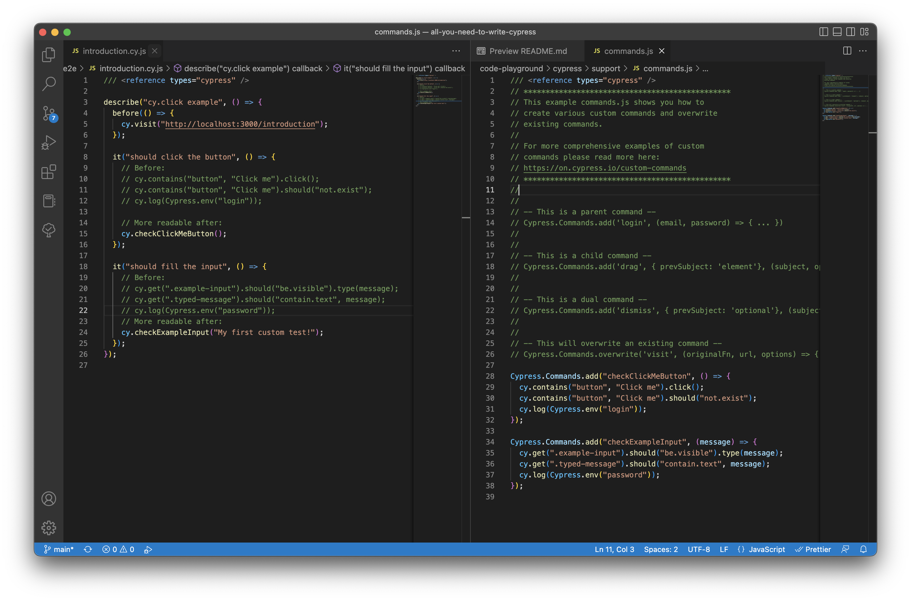

# Basics 

You got yourself started with some introductory stuff with cypress, you are able to write your first tests with it - that's awesome! 
But within the project you have to be able to understand some basics standing behind writing tests and organizing them. 

In this section we'll cover `folder structure`, `hooks`, `config`, `Cypress.env()` and `commands`,

## Organizing Tests (folder structure + hooks)

As it is well described on [Cypress documentation page](https://docs.cypress.io/guides/core-concepts/writing-and-organizing-tests#What-you-ll-learn) - and this article I highly recommend reading - I won't be covering every piece of that, but will cover what's most important (according to me). 

### Folder structure 

After opening cypress for the first time, it will generate few files and folders looking similar to this structure . Thing that can differ is folder e2e if you didn't clean it up after generating example specs. 

__downloads__ - folder you'll open to find files downloaded during test run. 

__e2e__ - folder containing your e2e test cases. 

__fixtures__ - here you want to store static data (fixtures) for test cases.

__support/commands.js__ - file for custom commands (we'll cover that later on)

__support/e2e.js__ - file to load before spec files load (can be used to setup global hooks)


### Hooks 

[docs about it](https://docs.cypress.io/guides/core-concepts/writing-and-organizing-tests#Hooks)

These are helpful to set conditions that you want to run before a set of tests or before each test. They're also helpful to clean up conditions after a set of tests or after each test.

<pre>
Hooks that aren't scoped 
<code>
before(() => {
  // root-level hook
  // runs once before all tests
})

beforeEach(() => {
  // root-level hook
  // runs before every test block
})

afterEach(() => {
  // runs after each test block
})

after(() => {
  // runs once all tests are done
})
</code>
</pre>

<pre>
Scoped Hooks 
<code>
describe('Scoped Hooks', () => {
  before(() => {
    // runs once before all tests in the block
  })

  beforeEach(() => {
    // runs before each test in the block
  })

  afterEach(() => {
    // runs after each test in the block
  })

  after(() => {
    // runs once after all tests in the block
  })
})
</code>
</pre>

___IMPORTANT NOTE___

It is better to prepare your environment (clean after your tests) in `before` hook than it is to do it in `after` hook. There's whole [docs page on it](https://docs.cypress.io/guides/references/best-practices#Using-after-or-afterEach-hooks), but long story short - `after` hook will not be run if test fails. Using `before` hook you are 100% sure, that __it will be__ executed, and if not -> whole test block will fail. 

Failing faster is better than failing later, because you'd have more time to correct yourself and debug what's wrong.

__Other useful hooks__ are `.skip` and `.only`, which allow you to specify which tests should be skipped or which should only be executed. See them in action:  




### Config 

[docs on this](https://docs.cypress.io/guides/references/configuration#Configuration-File)

Again, Cypress is having very good docs on it, I will just walk through the most important ones (or the ones that I want you to have opinion on). 

By default config file looks like this. . Here you'll define plugins (discussed later) and particular config entries that you might be interested in. Here are some of them:

| key | default | description
| ------- | --- | -------- | 
| `env` | {} | Any values to be set as environment variables.
| `includeShadowDom` | false | *(Can blow up memory in some applications, better use [.shadow()](https://docs.cypress.io/api/commands/shadow))* Whether to traverse shadow DOM boundaries and include elements within the shadow DOM in the results of query commands (e.g. cy.get()). 
| `numTestsKeptInMemory` | 50 | *(Can blow up memory in some applications - switch to 0 in that case)* The number of tests for which snapshots and command data are kept in memory. Basically it will allow you to go through test steps after execution.
| `defaultCommandTimeout` | 4000 | *(Some application will take more time to respond, instead of manually setting it for every comamnd you can set higher number here)* Time, in milliseconds, to wait until most DOM based commands are considered timed out. 
| `viewportHeight` | 660 | 	Default height in pixels for the application under tests' viewport. (Override with cy.viewport() command)
| `viewportWidth` | 1000 | 	Default width in pixels for the application under tests' viewport. (Override with cy.viewport() command)
| `baseUrl` | null | 	URL used as prefix for cy.visit() or cy.request() command's URL.

### Environment Variables

[docs on this](https://docs.cypress.io/guides/guides/environment-variables)

What are those weirdly sounding things? In simple words those are just variables shared across your test runs. If you have value that you'll be using constantly, like i.e. login and password (storing password in repository is a bad idea, but this example give some context and we'll cover that also :)), you can either hardcode them, or use them as environment variables and reference everywhere by using environment variables, like `Cypress.env('password')`. You can define environment variables in discussed config in `env` key, like shown on the picture.  or using CLI (command line interface), like

`npx cypress run --env login='admin',password='dupa1'` 
 
or in different ways, but I found those two most common - however you should learn more by reading docs.

### Custom commands

Cypress comes with its own API for creating custom commands and overwriting existing commands. The built in Cypress commands use the very same API that's defined [in the docs](https://docs.cypress.io/api/cypress-api/custom-commands#Syntax).

Having long chain of commands make your tests harder to understand, ergo maintain. What you should do, is wrap those functions within a custom one, that will handle simple task in a more concise way ([pure functions](https://en.wikipedia.org/wiki/Pure_function) having [single responsibility](https://www.digitalocean.com/community/conceptual-articles/s-o-l-i-d-the-first-five-principles-of-object-oriented-design) are prefered as they are easier to maintain). 

Besides adding command you can modify existing ones. I recommend doing that if needed and putting it in some visible place, so every team member is on the same page about built-in Cypress API. 

**EXAMPLE** 

*Description*: You want to login to your web application. This task will be repetitive, meaning you will use this method in many places in order to check it properly. 

*Initial solution*: You write your login tests like 
```js
...
cy.get('#login-input').type(Cypress.env('login'));
cy.get('#password-input').type(Cypress.env('password'));
cy.get('#submit-btn').should('not.be.disabled').click();
...
```
It's not bad to have this in a way that it is right now. But what about negative testcases, or desire to login as different user than predefined in environment variables?

Well that's the reason you should use Cypress Commands API. 

By defining custom function in `support/commands.js` you can get rid of all described problems. 

<pre>
support/commands.js
<code>
Cypress.Commands.add('login', (
    login = Cypress.env('login'), 
    password = Cypress.env('password')
  ) => {
  cy.get('#login-input').type(login)
  cy.get('#password-input').type(login)
  cy.get('#submit-btn').should('not.be.disabled').click();
})
</code>
</pre>

and then use it as `cy.login()` or `cy.login('admin', 'dupa2)` if you want to overwrite default behavior. [Read more on default parameters](https://developer.mozilla.org/en-US/docs/Web/JavaScript/Reference/Functions/Default_parameters)

### Recap 

That's it. Using this knowledge you should be able to understand some more advanced concepts like hooks, configs and using custom commands. 
Try to write test that uses Cypress.env, custom command and some before hook. My example can be found on the picture below. 



Experiment and have fun, from now on, it's only javascript knowledge that limits you. (wait until you learn about `cy.task` - magic) 

[Follow for part 3.](../3-Intermediate-API)
